 

## Découverte de la loco 241P17

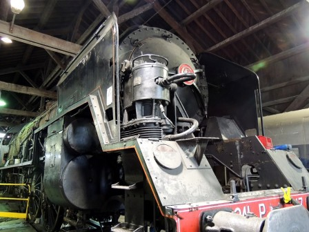

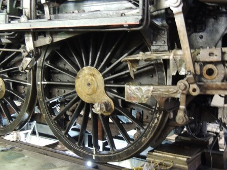

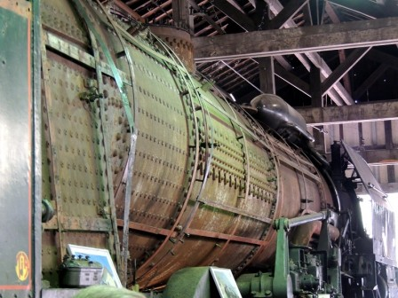

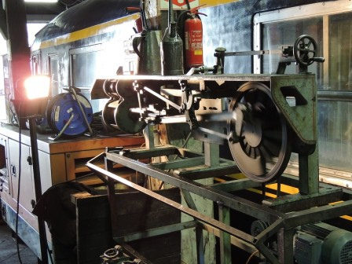

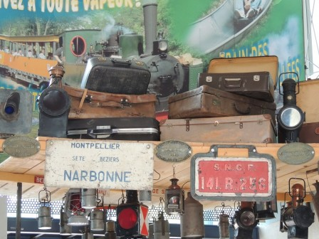

Wagon Restaurant:

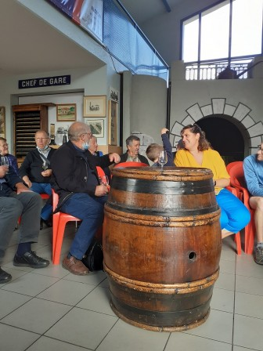

Apéro dégustation !

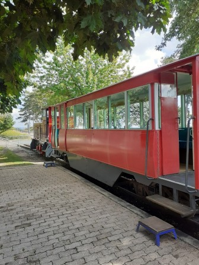

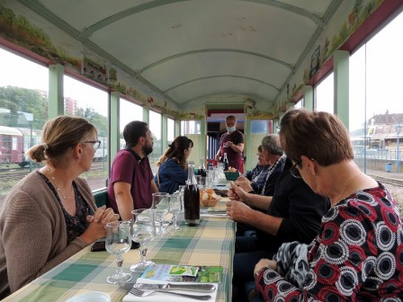

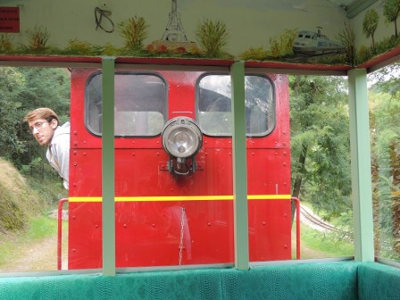

On fait confiance au conducteur !

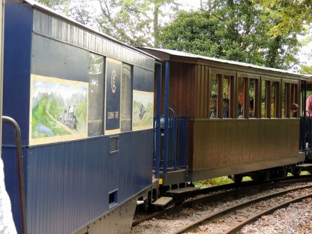

## Le musée de la mine à Blanzy

Le logement du mineur

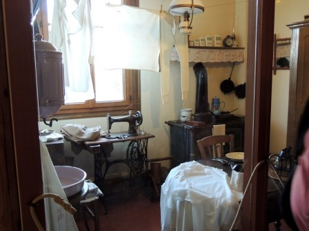

Le bureau du comptable

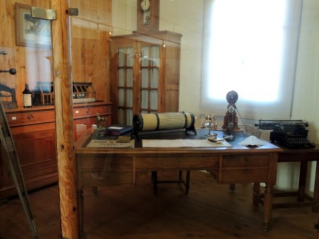

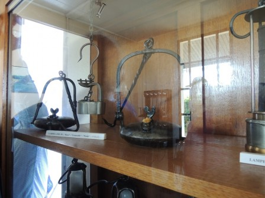

Les lampes pour la descente au fond

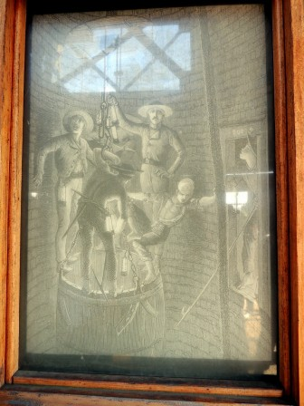

La descente dans la mine

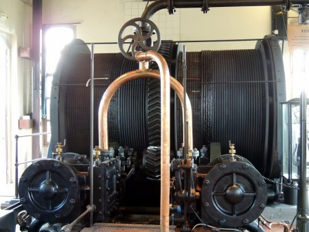

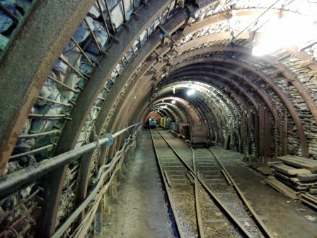

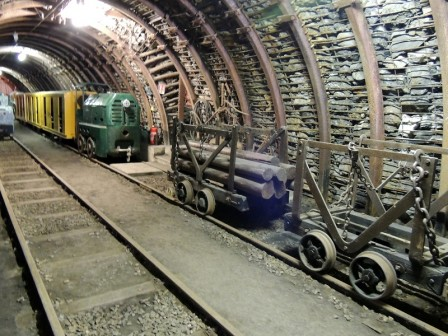

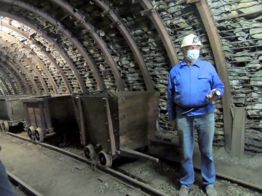

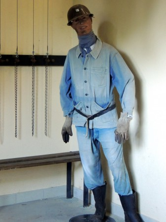

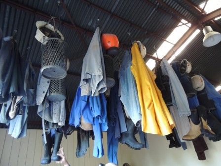

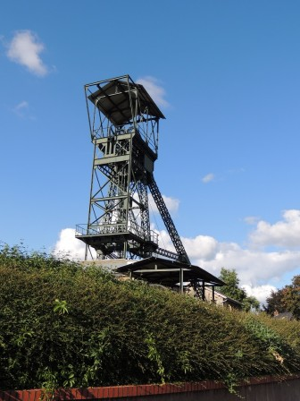
